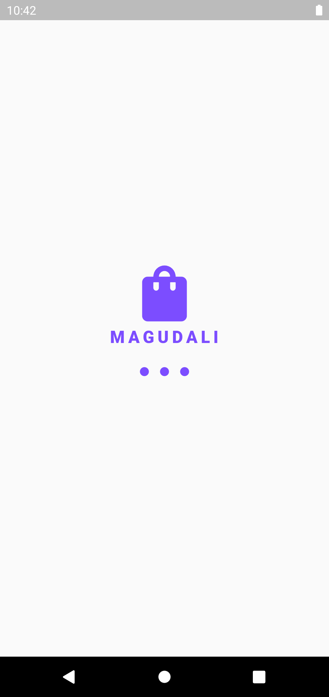
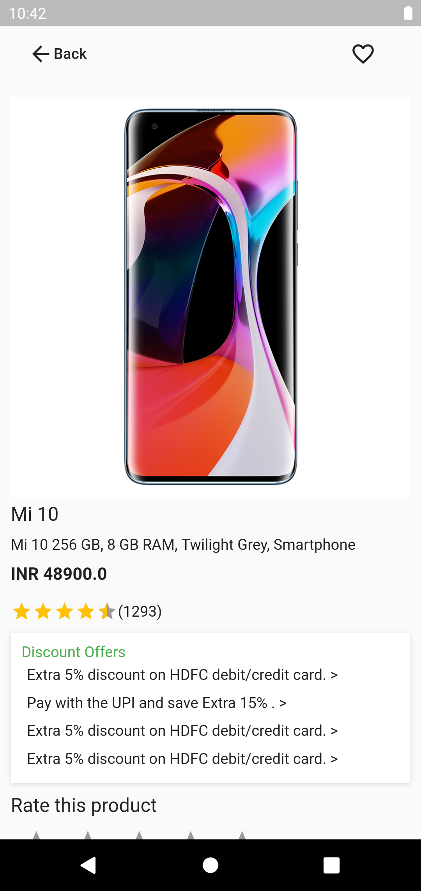

# Flutter E-Commerce App

Demostracion de un aplicacion e-commerce utilizando Flutter con GetX.

- Clonar el proyecto a su computador
```
git clone git@github.com:manuelduarte077/flutter_ecommerce_app_using_getx.git

```
- Navegar a la carpeta
```
cd flutter_ecommerce_app_using_getx

```
- Ejecutar el proyecto
```
flutter run 

```
cd project 

flutter pub get

flutter run

# Flutter Proof of Concept

  |   |   |  
-------------------------------------------|--------------------------------------------|--------------------------------------------|-------------------------------------------
  |   |   |  
  |  |  | 
 |  |                                           
