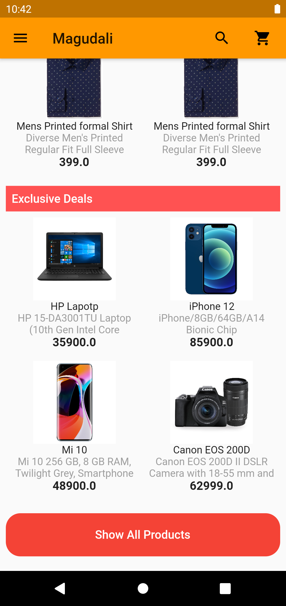
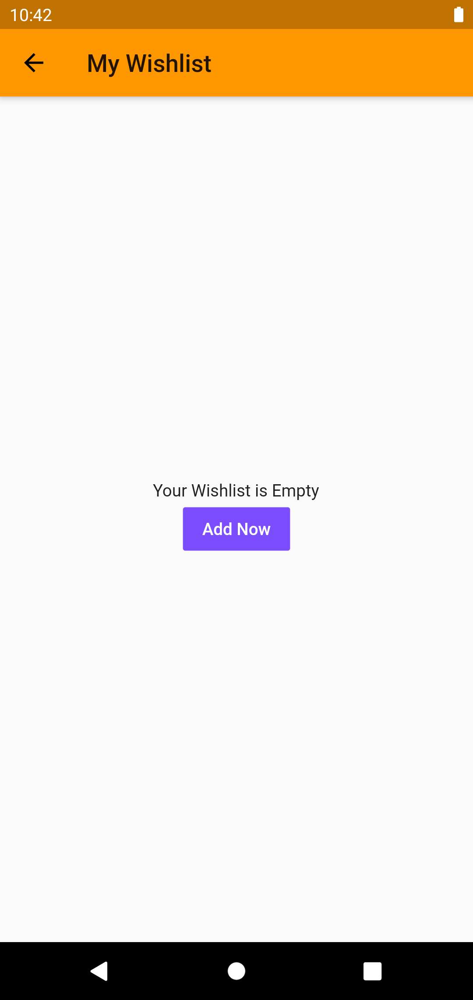

# Flutter E-Commerce App


```
git clone 
```

cd project 

flutter pub get

flutter run

## ScreenShots
<table style="width:100%">
  <tr>
    <th>1. Home Screen</th>
    <th>2. Desc Screen</th> 
  </tr>
  <tr>
    <td></td>
    <td></td>
    <td></td>
    <td></td>
  </tr>
  <tr>
    <td></td>
    <td></td>
    <td></td>
    <td></td>
  </tr>  
  <tr>
    <td></td>
    <td></td>
    <td></td>
    <td></td>
  </tr>
  <tr>
    <td></td>
    <td></td>
    <td></td>
  </tr>
</table>
