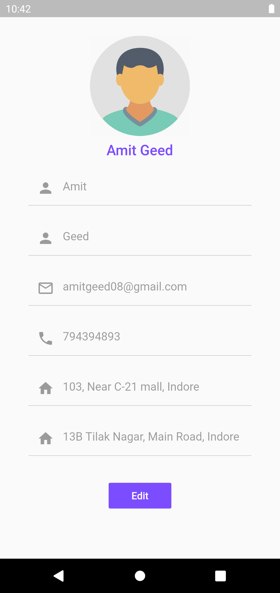

# Flutter E-Commerce App

Demostracion de un aplicacion e-commerce utilizando Flutter con GetX.

- Clonar el proyecto a su computador
```
git clone git@github.com:manuelduarte077/flutter_ecommerce_app_using_getx.git
```
## Pasos para correr el proyecto

- Navegar a la carpeta
```
cd flutter_ecommerce_app_using_getx
```

- Istalar los paquetes
```
flutter pub get

```
- Ejecutar el proyecto
```
flutter run 
```

### Herramientas 

- Para instalar este proyecto nesesitas instalar el SDK de Dark y FLutter.

- Tambien nesesita tener visual studio code o android studio con las extenciones dart y flutter.

Instalacion:

#### Windows
- Visual Studio Code   👉 [Descargar](https://code.visualstudio.com/ "Descargar") 
- Android Studio   👉 [Descargar](https://developer.android.com/studio?hl=es-419&gclid=Cj0KCQjwu7OIBhCsARIsALxCUaO5PyDfN71LXr7HABTa4cMFemhVfqVXet2pXzfU-bWC630h6C4V5KkaAvtNEALw_wcB&gclsrc=aw.ds "Descargar")
- Flutter [Descargar](https://flutter.dev/?gclid=Cj0KCQjwu7OIBhCsARIsALxCUaOaX8gmgmcYJ8GDozs4G_3OhLfUQYS_-BkMuHTA1qKlxHTUEzYxmLEaAlHxEALw_wcB&gclsrc=aw.ds "Descargar")

#### Linux
- Visual Studio Code   👉 [Descargar](https://code.visualstudio.com/ "Descargar") 
- Android Studio   👉 [Descargar](https://developer.android.com/studio?hl=es-419&gclid=Cj0KCQjwu7OIBhCsARIsALxCUaO5PyDfN71LXr7HABTa4cMFemhVfqVXet2pXzfU-bWC630h6C4V5KkaAvtNEALw_wcB&gclsrc=aw.ds "Descargar")
- Flutter [Descargar](https://flutter.dev/docs/get-started/install/linux "Descargar")

#### MacOS
- Visual Studio Code   👉 [Descargar](https://code.visualstudio.com/ "Descargar") 
- Android Studio   👉 [Descargar](https://developer.android.com/studio?hl=es-419&gclid=Cj0KCQjwu7OIBhCsARIsALxCUaO5PyDfN71LXr7HABTa4cMFemhVfqVXet2pXzfU-bWC630h6C4V5KkaAvtNEALw_wcB&gclsrc=aw.ds "Descargar")
- Flutter [Descargar](https://flutter.dev/docs/get-started/install/macos "Descargar")

 
*Nota 1: Android Studio viene con un emulador de Android*

------------


### Paquetes y dependencias utilizadas 
Las dependencias estan alojadas en el fichero pubspec.yaml en la raiz del proyecto.
- get: ^4.3.4
- flutter_rating_bar: ^3.0.1+1
- loading: ^1.0.2
- device_preview: ^0.4.8

encontrar paquetes en [pup.dev](https://pub.dev/ "pup.dev")

------------

### Descripcion general del proyecto 
*Nota 1: Este proyecto  está configurado para usarse en Windows, Linux, Mac*

*Nota 2:  Puedes correr la aplicacion en tu celular fisico o emuladores Android o IOs*

- Lenguajes
	- Dart
- Editores & IDE
	- Visual Studio Code
  - Android Studio
- Frameworks
	- Flutter
- Emuladores utilzados
	- Emulador de Android Studio
  
------------

# Arbol de Carpetas

```
Magudali-E-Commerce
├───proof_concept_1
│   ├───android
│   ├───assets
│   ├───ios
│   ├───lib
│   │    └───controller
│   │    └───model
│   │    └───utils
│   │    └───view
│   │    └main.dart
│   └───test


```


# Flutter Proof of Concept

  |   |   |  
-------------------------------------------|--------------------------------------------|--------------------------------------------|-------------------------------------------
  |   |   |  
  |  |  | 
 |  |                                           
